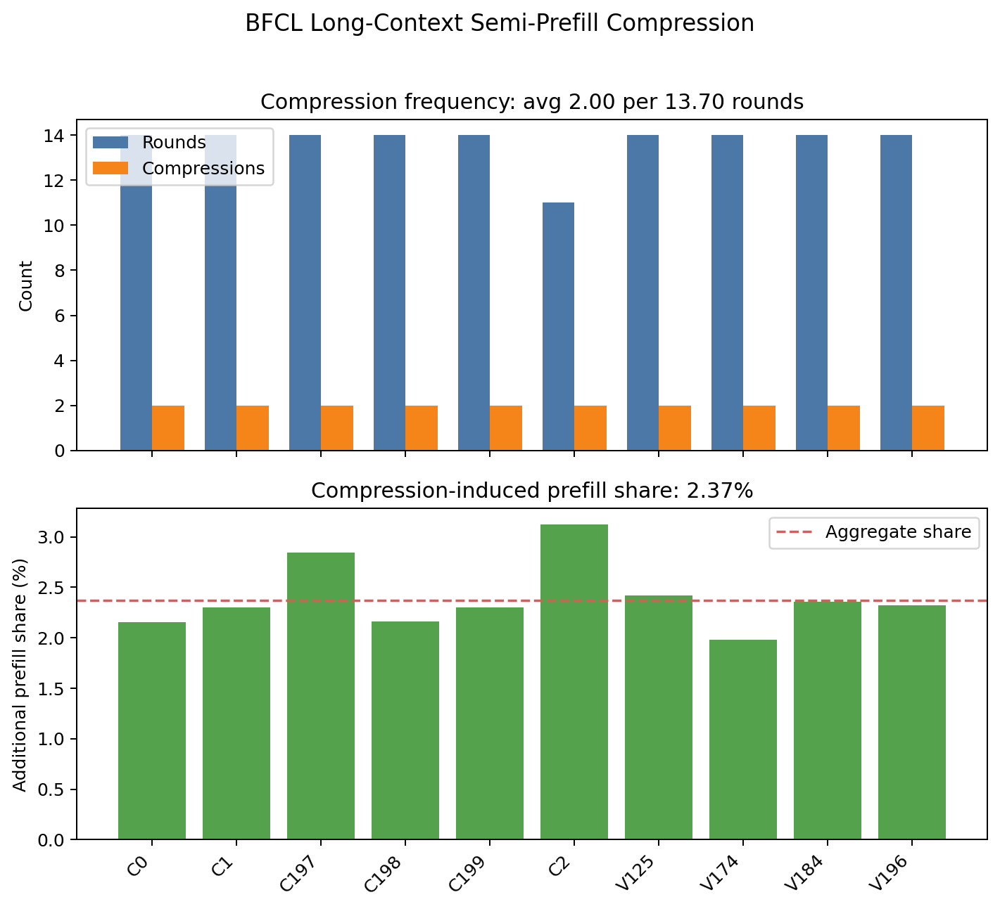
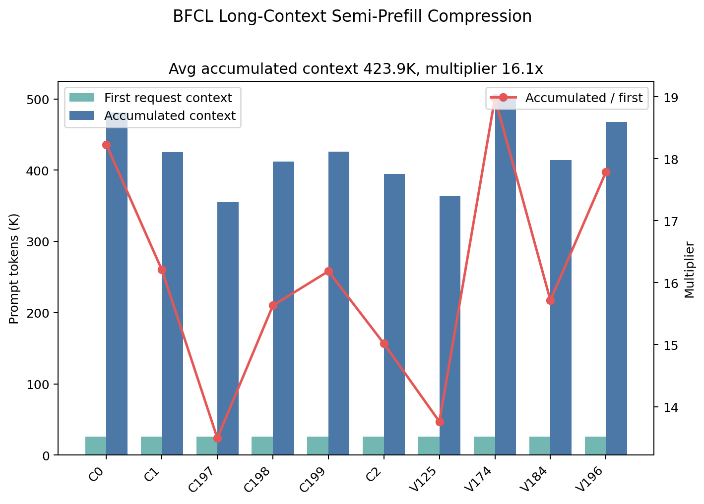
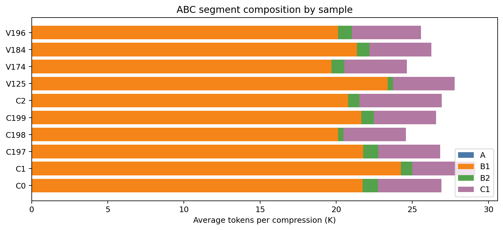
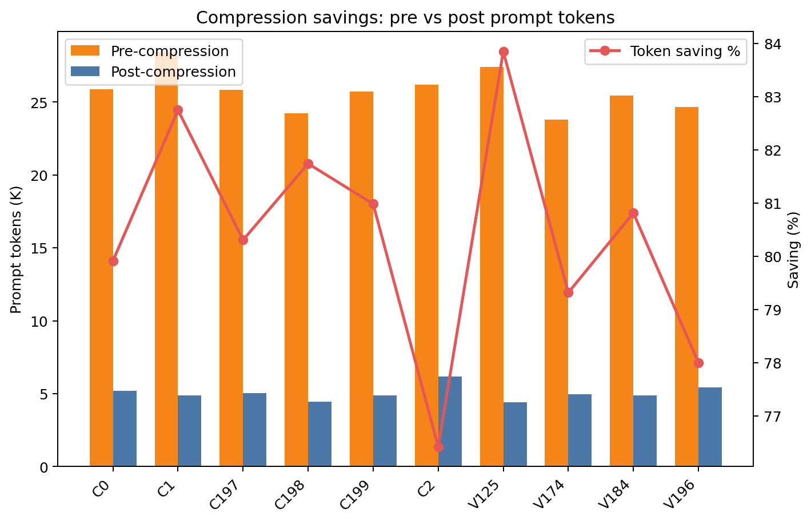
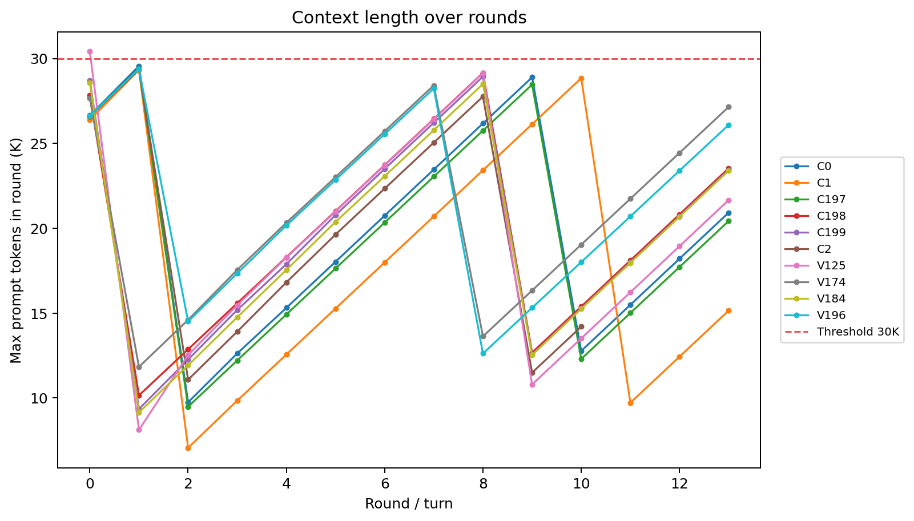
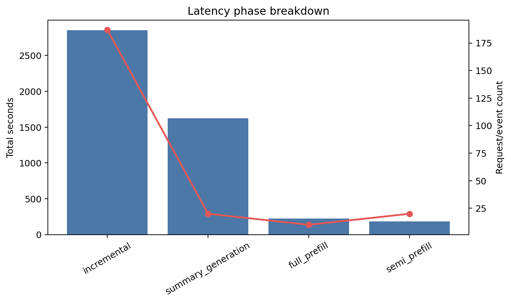

# BFCL Long-Context Semi-Prefill Compression 分析报告

生成时间：20260507

## 结论摘要

- 可读样本数：10；有效 timing 样本数：10；压缩事件数：20；总 rounds：137；总 LLM calls：217。
- 平均每个 agentic request 运行 13.70 rounds / 21.70 LLM calls，并触发 2.00 次压缩。
- 压缩引入的额外 prefill tokens 为 100,610，占累计 prompt/context tokens 的 2.37%。
- 单请求平均累计上下文为 423,920 tokens；相比首轮单次请求，平均为 16.10x，样本范围为 13.5x-19.0x。

score summary 中 validate 样本均为 invalid，本文只把这些日志作为压缩与 prefill 工作负载证据，不作为 benchmark accuracy 结论。

## 数据口径

- `rounds` 优先采用 run summary 中的 turns/decoded_turns；没有 summary 时使用 timing 日志中的唯一 turn 数。
- `LLM calls` 来自 `timing/*.json` 记录条数。
- 每请求均值只使用 `steps>0` 且首轮 `prompt_tokens>0` 的有效 timing 样本；空样本仍保留在完整性统计和样本表中。
- `accumulated context` 定义为单个样本所有 LLM request 的 `prompt_tokens` 之和。
- `single-round inference` 对照定义为该样本第一条 timing 记录的 `prompt_tokens`。
- `additional prefill tokens due to compression` 优先采用 timing 的 `semi_prefill_tokens`；若没有该字段，则采用 ABC 压缩事件中的 `B2+C1`。
- 本报告不读取或输出长 prompt 原文，只保留 timing/ABC 的标量统计字段。

## 数据完整性

| 项目 | 数量 |
| --- | ---: |
| timing files | 10 |
| ABC files | 10 |
| trace files | 10 |
| prompt log files | 10 |
| checkpoint files | 1 |
| declared sample ids | - |

## Figure 1：压缩频率与额外 Prefill 占比

As shown in Figure 1, a single agentic request invokes 2.00 compressions per 13.70 rounds on average, while the additional prefill tokens due to compression account for 2.37% of accumulated prompt tokens.

中文解读：图 1 同时展示每个样本的 rounds、压缩次数和压缩导致的额外 prefill 占比。整体压缩频率为 0.15 次/round，这对应压缩触发概率 P 的经验估计。

## Figure 2：多轮累计上下文与单轮对照

As shown in Figure 2, a single agentic request often spans 13.70 rounds and accumulates a total of 423.9K context tokens, which is 13.5x-19.0x longer than single-round inference.

中文解读：图 2 展示首轮上下文、累计上下文以及累计/首轮倍数。该图说明 agentic request 的成本不能只按单轮推理估计；多轮调用会重复携带或重建大量上下文。

## 样本工作负载表

| 样本 | run | rounds | LLM calls | compressions | P | first ctx | max ctx | acc ctx | acc/first | extra prefill |
| --- | --- | --- | --- | --- | --- | --- | --- | --- | --- | --- |
| C0 | continue6_llama_twocompress_t14_g2600_20260506 | 14 | 23 | 2 | 0.14 | 26,370 | 29,561 | 480,727 | 18.23 | 2.15% |
| C1 | continue6_llama_twocompress_t14_g2600_20260506 | 14 | 23 | 2 | 0.14 | 26,229 | 29,317 | 425,108 | 16.21 | 2.30% |
| C197 | continue6_llama_twocompress_t14_g2600_20260506 | 14 | 17 | 2 | 0.14 | 26,343 | 29,428 | 355,396 | 13.49 | 2.85% |
| C198 | continue6_llama_twocompress_t14_g2600_20260506 | 14 | 19 | 2 | 0.14 | 26,364 | 29,158 | 412,130 | 15.63 | 2.16% |
| C199 | continue6_llama_twocompress_t14_g2600_20260506 | 14 | 25 | 2 | 0.14 | 26,326 | 28,934 | 426,076 | 16.18 | 2.30% |
| C2 | continue6_llama_twocompress_t14_g2600_20260506 | 11 | 19 | 2 | 0.18 | 26,272 | 29,366 | 394,545 | 15.02 | 3.12% |
| V125 | validate_llama_125_twocompress_t14_g2600_20260506 | 14 | 20 | 2 | 0.14 | 26,393 | 30,411 | 363,145 | 13.76 | 2.42% |
| V174 | validate_llama_174_twocompress_t14_g2600_20260506 | 14 | 25 | 2 | 0.14 | 26,348 | 28,421 | 500,044 | 18.98 | 1.98% |
| V184 | validate_llama_184_twocompress_t14_g2600_20260506 | 14 | 23 | 2 | 0.14 | 26,351 | 28,576 | 414,147 | 15.72 | 2.35% |
| V196 | validate_llama_196_twocompress_t14_g2600_20260506 | 14 | 23 | 2 | 0.14 | 26,304 | 29,383 | 467,882 | 17.79 | 2.32% |

## 压缩事件表

| 样本 | idx | turn | step | pre | post | B1 | B2 | C1 | B2+C1 | saving | summary s |
| --- | --- | --- | --- | --- | --- | --- | --- | --- | --- | --- | --- |
| C0 | 1 | 2 | 0 | 26,199 | 3,623 | 23,274 | 698 | 2,925 | 3,623 | 86.17% | 77.2 |
| C0 | 2 | 10 | 0 | 25,572 | 6,735 | 20,184 | 1,347 | 5,388 | 6,735 | 73.66% | 142.6 |
| C1 | 1 | 2 | 0 | 28,625 | 3,425 | 25,697 | 497 | 2,928 | 3,425 | 88.03% | 70.1 |
| C1 | 2 | 11 | 0 | 28,194 | 6,354 | 22,808 | 968 | 5,386 | 6,354 | 77.46% | 98.7 |
| C197 | 1 | 2 | 0 | 26,343 | 3,651 | 23,598 | 907 | 2,744 | 3,651 | 86.14% | 118.3 |
| C197 | 2 | 10 | 0 | 25,339 | 6,468 | 19,959 | 1,088 | 5,380 | 6,468 | 74.47% | 132.3 |
| C198 | 1 | 1 | 0 | 23,552 | 3,195 | 20,730 | 374 | 2,821 | 3,195 | 86.43% | 32.3 |
| C198 | 2 | 9 | 0 | 24,918 | 5,718 | 19,529 | 329 | 5,389 | 5,718 | 77.05% | 24.0 |
| C199 | 1 | 1 | 0 | 25,644 | 3,064 | 22,884 | 305 | 2,759 | 3,064 | 88.05% | 31.5 |
| C199 | 2 | 9 | 0 | 25,822 | 6,735 | 20,430 | 1,343 | 5,392 | 6,735 | 73.92% | 158.3 |
| C2 | 1 | 2 | 0 | 27,003 | 5,909 | 21,541 | 447 | 5,462 | 5,909 | 78.12% | 59.1 |
| C2 | 2 | 9 | 0 | 25,396 | 6,420 | 20,013 | 1,037 | 5,383 | 6,420 | 74.72% | 112.3 |
| V125 | 1 | 1 | 0 | 28,058 | 3,055 | 25,352 | 350 | 2,705 | 3,055 | 89.11% | 35.6 |
| V125 | 2 | 9 | 0 | 26,795 | 5,736 | 21,405 | 346 | 5,390 | 5,736 | 78.59% | 25.3 |
| V174 | 1 | 1 | 0 | 23,438 | 3,223 | 20,605 | 391 | 2,832 | 3,223 | 86.25% | 34.4 |
| V174 | 2 | 8 | 0 | 24,170 | 6,674 | 18,792 | 1,296 | 5,378 | 6,674 | 72.39% | 109.6 |
| V184 | 1 | 1 | 0 | 25,479 | 3,047 | 22,746 | 315 | 2,732 | 3,047 | 88.04% | 32.4 |
| V184 | 2 | 9 | 0 | 25,382 | 6,703 | 19,993 | 1,314 | 5,389 | 6,703 | 73.59% | 101.7 |
| V196 | 1 | 1 | 1 | 24,375 | 4,248 | 20,675 | 548 | 3,700 | 4,248 | 82.57% | 71.9 |
| V196 | 2 | 8 | 0 | 24,945 | 6,627 | 19,576 | 1,258 | 5,369 | 6,627 | 73.43% | 157.2 |

ABC 分段图如下：

压缩前后 prompt token 对比如下：

## Context 长度随轮次变化

这张图采用每个 round 内最大的 `prompt_tokens` 作为该 round 的上下文长度。如果 run_config 中存在 threshold，图中会画出阈值线。

## Timing / Phase Breakdown

| phase | count | prompt tokens | output tokens | total s |
| --- | --- | --- | --- | --- |
| full_prefill | 10 | 263,300 | 719 | 222.2 |
| incremental | 187 | 3,761,452 | 8,865 | 2,853.4 |
| semi_prefill | 20 | 214,448 | 1,005 | 181.9 |
| summary_generation | 20 | 0 | 0 | 1,624.9 |

## 配置摘要

| run | key | value |
| --- | --- | --- |
| continue6_llama_twocompress_t14_g2600_20260506 | model | Llama-3.3-70B-Instruct |
| continue6_llama_twocompress_t14_g2600_20260506 | model_path | /root/share/models/Llama-3.3-70B-Instruct |
| continue6_llama_twocompress_t14_g2600_20260506 | data_file | data/BFCL_v4_multi_turn_long_context_sp_continue6_197_198_199_0_1_2_t14_g2600.json |
| continue6_llama_twocompress_t14_g2600_20260506 | proxy_url | http://localhost:6003/v1 |
| continue6_llama_twocompress_t14_g2600_20260506 | preset.name | cw32k_thr30000_c12600 |
| continue6_llama_twocompress_t14_g2600_20260506 | preset.context_window | 32000 |
| continue6_llama_twocompress_t14_g2600_20260506 | preset.reserve_tokens | 2000 |
| continue6_llama_twocompress_t14_g2600_20260506 | preset.keep_recent_tokens | 2600 |
| continue6_llama_twocompress_t14_g2600_20260506 | preset.summary_max_tokens | 1024 |
| continue6_llama_twocompress_t14_g2600_20260506 | preset.threshold | 30000 |
| continue6_llama_twocompress_t14_g2600_20260506 | compression_enabled | True |
| continue6_llama_twocompress_t14_g2600_20260506 | targets.p_max_1_5 | 0.2 |
| continue6_llama_twocompress_t14_g2600_20260506 | targets.p_max_1_6 | 0.16666666666666666 |
| continue6_llama_twocompress_t14_g2600_20260506 | targets.c1_min_tokens | 2000 |
| continue6_llama_twocompress_t14_g2600_20260506 | targets.c1_max_tokens | 3000 |
| validate_llama_125_twocompress_t14_g2600_20260506 | model | Llama-3.3-70B-Instruct |
| validate_llama_125_twocompress_t14_g2600_20260506 | model_path | /root/share/models/Llama-3.3-70B-Instruct |
| validate_llama_125_twocompress_t14_g2600_20260506 | data_file | data/BFCL_v4_multi_turn_long_context_sp_125_174_184_196_twocompress_t14_g2600.json |
| validate_llama_125_twocompress_t14_g2600_20260506 | proxy_url | http://localhost:6003/v1 |
| validate_llama_125_twocompress_t14_g2600_20260506 | preset.name | cw32k_thr30000_c12600 |
| validate_llama_125_twocompress_t14_g2600_20260506 | preset.context_window | 32000 |
| validate_llama_125_twocompress_t14_g2600_20260506 | preset.reserve_tokens | 2000 |
| validate_llama_125_twocompress_t14_g2600_20260506 | preset.keep_recent_tokens | 2600 |
| validate_llama_125_twocompress_t14_g2600_20260506 | preset.summary_max_tokens | 1024 |
| validate_llama_125_twocompress_t14_g2600_20260506 | preset.threshold | 30000 |
| validate_llama_125_twocompress_t14_g2600_20260506 | targets.p_max_1_5 | 0.2 |
| validate_llama_125_twocompress_t14_g2600_20260506 | targets.p_max_1_6 | 0.16666666666666666 |
| validate_llama_125_twocompress_t14_g2600_20260506 | targets.c1_min_tokens | 2000 |
| validate_llama_125_twocompress_t14_g2600_20260506 | targets.c1_max_tokens | 3000 |
| validate_llama_174_twocompress_t14_g2600_20260506 | model | Llama-3.3-70B-Instruct |
| validate_llama_174_twocompress_t14_g2600_20260506 | model_path | /root/share/models/Llama-3.3-70B-Instruct |
| validate_llama_174_twocompress_t14_g2600_20260506 | data_file | data/BFCL_v4_multi_turn_long_context_sp_125_174_184_196_twocompress_t14_g2600.json |
| validate_llama_174_twocompress_t14_g2600_20260506 | proxy_url | http://localhost:6003/v1 |
| validate_llama_174_twocompress_t14_g2600_20260506 | preset.name | cw32k_thr30000_c12600 |
| validate_llama_174_twocompress_t14_g2600_20260506 | preset.context_window | 32000 |
| validate_llama_174_twocompress_t14_g2600_20260506 | preset.reserve_tokens | 2000 |
| validate_llama_174_twocompress_t14_g2600_20260506 | preset.keep_recent_tokens | 2600 |
| validate_llama_174_twocompress_t14_g2600_20260506 | preset.summary_max_tokens | 1024 |
| validate_llama_174_twocompress_t14_g2600_20260506 | preset.threshold | 30000 |
| validate_llama_174_twocompress_t14_g2600_20260506 | targets.p_max_1_5 | 0.2 |

_表中展示前 40 条；完整数据见 tables/*.csv。_

## Score / Validity 摘要

| 样本 | run | valid | score | error |
| --- | --- | --- | --- | --- |
| V125 | validate_llama_125_twocompress_t14_g2600_20260506 | no | 0.00 | multi_turn:empty_turn_model_response |
| V174 | validate_llama_174_twocompress_t14_g2600_20260506 | no | 0.00 | multi_turn:instance_state_mismatch |
| V184 | validate_llama_184_twocompress_t14_g2600_20260506 | no | 0.00 | multi_turn:execution_response_mismatch |
| V196 | validate_llama_196_twocompress_t14_g2600_20260506 | no | 0.00 | multi_turn:instance_state_mismatch |

## 证据与限制

已验证：

- timing、ABC、trace/prompt log/checkpoint 文件数量已经按文件系统重新扫描。
- 所有核心数值都写入 `analysis_results.json` 与 `tables/*.csv`，报告中的 Figure 1/2 文案由同一份 JSON 指标生成。
- 图表均来自 timing 和 ABC 的标量字段，不依赖 README 或旧报告文字。

未验证：

- 本分析不是一次新的 benchmark run，也不证明未完成样本可以跑满目标 turns。
- BFCL validity/score 若为 invalid，仅说明这些样本不能作为最终准确率结论；压缩次数、上下文长度和 prefill token 统计仍可作为运行日志证据。
- `additional prefill tokens` 是按日志可见的 semi-prefill 或 ABC `B2+C1` 估算；如果底层推理服务还有隐藏 prefix-cache 命中/失效，该比例不包含未记录的内部实现细节。

## 产物清单

- `analysis_results.json`：完整结构化统计。
- `tables/sample_workload.csv`：样本级工作负载表。
- `tables/compression_events.csv`：压缩事件表。
- `tables/phase_breakdown.csv`：阶段耗时与 token 表。
- `charts/*.png`：报告图表。
- `code/generate_analysis.py`：生成本目录产物的脚本副本。
